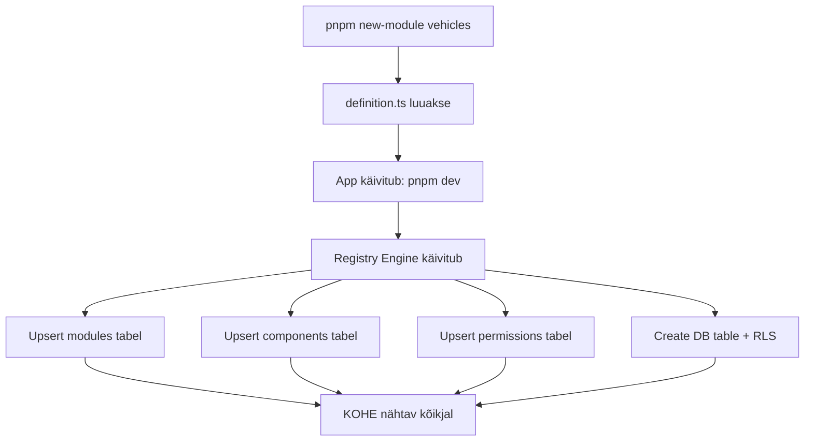
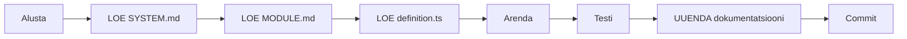

# 🎯 EOS2 MODULAARNE SÜSTEEM - CLAUDE CODE MASTER JUHEND

**Kuupäev:** 04.12.2025  
**Versioon:** 1.0  
**Projekt:** EOS2 - Enterprise Operating System 2  
**Arendaja:** Silver @ Rivest OÜ

---

## 📋 SISUKORD

1. [VISIO ON JA EESMÄRGID](#1-visioon-ja-eesmärgid)
2. [ARHITEKTUURI PÕHIMÕTTED](#2-arhitektuuri-põhimõtted)
3. [FAILIDE STRUKTUUR](#3-failide-struktuur)
4. [AUTOMAATNE REGISTREERIMINE](#4-automaatne-registreerimine)
5. [ÕIGUSTE SÜSTEEM](#5-õiguste-süsteem)
6. [ADMIN KONTROLLSÜSTEEM](#6-admin-kontrollsüsteem)
7. [DESIGN SYSTEM](#7-design-system)
8. [ARENDUSPROTSESS](#8-arendusprotsess)
9. [MIGRATSIOONID JA ANDMEBAAS](#9-migratsioonid-ja-andmebaas)
10. [TESTIMINE JA KVALITEET](#10-testimine-ja-kvaliteet)
11. [DEPLOYMENTJA CI/CD](#11-deployment-ja-cicd)
12. [TROUBLESHOOTING](#12-troubleshooting)

---

## 1. VISIOON JA EESMÄRGID

### 🎯 Põhivisioon

EOS2 on **modulaarne ERP platvorm**, kus:
- ✅ Iga alamleht on iseseisev moodul (Ladu, Arved, Sõidukid, Projektid...)
- ✅ Moodulid on omavahel seotud (Arve → Projekt → Klient)
- ✅ Uue mooduli lisamine on lihtne (~30 min, mitte päevad!)
- ✅ Claude Code teab alati kus mis on
- ✅ Kõik on ühes kohas - ka Supabase migratsioonid
- ✅ Admin näeb KÕIKE - vigasid, poolikuid asju, statistikat
- ✅ Ühtne disain - design system
- ✅ Täielik õiguste kontroll - iga kasutaja, iga moodul, iga komponent

### 🎨 Disaini Põhimõte

> **"Lego-stiilis ERP süsteem"** - moodulid nagu klotsid, millest saab ehitada terviklikke lahendusi

```
┌─────────────┐  ┌─────────────┐  ┌─────────────┐
│  PROJEKTID  │←→│   KLIENDID  │←→│    ARVED    │
└─────────────┘  └─────────────┘  └─────────────┘
       ↕               ↕               ↕
┌─────────────┐  ┌─────────────┐  ┌─────────────┐
│    LADU     │  │  SÕIDUKID   │  │   PLANNER   │
└─────────────┘  └─────────────┘  └─────────────┘
```

### ⚡ Võtmeomadused

| Omadus | Kirjeldus |
|--------|-----------|
| **Kiirus** | Uus moodul 30 minutiga |
| **Lihtsus** | Üks config fail = kogu moodul |
| **Kontroll** | Admin näeb kõike |
| **Turvalisus** | RLS + õiguste maatriks |
| **Skaleeruvus** | Piiramatu moodulite arv |
| **Dokumenteeritus** | Claude loeb SYSTEM.md alati |

---

## 2. ARHITEKTUURI PÕHIMÕTTED

### 📐 Single Source of Truth

```typescript
// modules/vehicles/definition.ts
export default defineModule({
  name: 'vehicles',
  label: 'Sõidukid',
  // ... üks fail loob KÕIK automaatselt:
  // ✅ DB tabel
  // ✅ RLS poliitikad
  // ✅ Menüü kirje
  // ✅ Õigused
  // ✅ Admin register
})
```

### 🏗️ Kihiline arhitektuur

```
┌─────────────────────────────────────┐
│         PRESENTATION LAYER          │
│   (React Components, Pages)         │
└─────────────────────────────────────┘
                 ↕
┌─────────────────────────────────────┐
│          BUSINESS LOGIC             │
│   (Hooks, Services, Validation)     │
└─────────────────────────────────────┘
                 ↕
┌─────────────────────────────────────┐
│            DATA LAYER               │
│   (Supabase, RLS, Migrations)       │
└─────────────────────────────────────┘
```

### 🔄 DRY Põhimõte

**Ära kunagi kopeeri koodi!**

✅ **ÕIGE:**
```typescript
import { useResource } from '@/core/data/useResource'
import { DataTable } from '@/core/ui/DataTable'
```

❌ **VALE:**
```typescript
// Copy-paste sama koodi igasse moodulisse
```

### 📦 Mooduli anatoomia

```
modules/vehicles/
├── definition.ts      # ⭐ SINGLE SOURCE OF TRUTH
├── MODULE.md          # 📖 Claude loeb seda
├── pages/
│   ├── index.tsx      # Nimekiri
│   ├── [id].tsx       # Detail
│   └── new.tsx        # Uus kirje
├── components/
│   ├── VehicleForm.tsx
│   └── VehicleCard.tsx
└── hooks/
    └── useVehicleLogic.ts
```

---

## 3. FAILIDE STRUKTUUR

### 📁 Täielik struktuur

```
eos2/
├── 📄 SYSTEM.md              # ⭐ Claude loeb ALATI ESIMESENA
├── 📄 TODO.md                # Bugid, poolikud asjad
├── 📄 CHANGELOG.md           # Muudatuste logi
│
├── 📁 database/              # ⭐ KOGU DB ühes kohas
│   ├── migrations/           # SQL migratsioonid
│   │   ├── 001_initial.sql
│   │   ├── 002_modules_system.sql
│   │   └── 003_permissions.sql
│   ├── rls/                  # RLS poliitikad
│   │   ├── tenants.sql
│   │   └── modules.sql
│   ├── functions/            # PostgreSQL funktsioonid
│   │   └── get_user_permissions.sql
│   └── seeds/                # Test andmed
│       └── demo_data.sql
│
├── 📁 design/                # ⭐ KOGU DISAIN ühes kohas
│   ├── tokens.ts             # Värvid, spacing, font
│   ├── theme.ts              # Ant Design theme
│   └── components/           # Stiliseeritud komponendid
│       └── styled-button.tsx
│
├── 📁 core/                  # ⭐ JAGATUD SÜSTEEM
│   ├── permissions/          # Rollid + maatriks
│   │   ├── index.ts          # Eksport
│   │   ├── roles.ts          # Role definitsioonid
│   │   ├── actions.ts        # Toimingud
│   │   └── matrix.ts         # Õiguste maatriks
│   │
│   ├── ui/                   # Universaalsed komponendid
│   │   ├── DataTable.tsx     # Universaalne tabel
│   │   ├── FormBuilder.tsx   # Dünaamiline vorm
│   │   ├── StatusBadge.tsx   # Staatuse badge
│   │   └── index.ts
│   │
│   ├── data/                 # Data layer
│   │   ├── useResource.ts    # CRUD hook
│   │   ├── useFilters.ts     # Filtreerimine
│   │   └── usePagination.ts  # Lehekülgede jaotus
│   │
│   └── registry/             # Moodulite register
│       ├── registerModule.ts # Registreerimise loogika
│       └── getModules.ts     # Moodulite pärimine
│
├── 📁 modules/               # ⭐ KÕIK MOODULID
│   ├── _core/                # Jagatud ressursid
│   │   └── BaseModule.ts
│   │
│   ├── _template/            # Uue mooduli alus
│   │   ├── definition.ts
│   │   ├── MODULE.md
│   │   └── pages/
│   │
│   ├── projects/             # Projektide moodul
│   │   ├── definition.ts     # ⭐ Config
│   │   ├── MODULE.md         # ⭐ Dokumentatsioon
│   │   ├── pages/
│   │   ├── components/
│   │   └── hooks/
│   │
│   ├── clients/              # Klientide moodul
│   ├── invoices/             # Arvete moodul
│   ├── warehouse/            # Laomoodul
│   └── vehicles/             # Sõidukite moodul
│
├── 📁 admin/                 # ⭐ ADMIN PANEEL
│   └── pages/
│       ├── index.tsx         # Dashboard
│       ├── system.tsx        # Süsteemi tervis
│       ├── modules.tsx       # Moodulite haldus
│       ├── permissions.tsx   # Õiguste maatriks
│       ├── users.tsx         # Kasutajad
│       └── errors.tsx        # Vigade log
│
├── 📁 scripts/               # Automatiseerimise skriptid
│   ├── new-module.ts         # Uue mooduli loomine
│   ├── db-migrate.ts         # Migratsioonid
│   ├── check-system.ts       # Süsteemi kontroll
│   └── generate-types.ts     # TypeScript tüübid
│
└── 📁 apps/web/              # Next.js rakendus
    ├── src/
    ├── package.json
    └── next.config.js
```

---

## 4. AUTOMAATNE REGISTREERIMINE

### 🚀 Kuidas see töötab?



### 📄 definition.ts - Single Source of Truth

```typescript
// modules/vehicles/definition.ts

import { defineModule } from '@/core/registry'

export default defineModule({
  // ═══════════════════════════════════════
  // BAASTEAVE
  // ═══════════════════════════════════════
  name: 'vehicles',           // Unikaalne ID
  label: 'Sõidukid',          // Eestikeelne nimi
  labelSingular: 'Sõiduk',    // Ainsus
  icon: 'Car',                // Ant Design ikoon
  description: 'Sõidukipargi haldus',
  
  // ═══════════════════════════════════════
  // MENÜÜ
  // ═══════════════════════════════════════
  menu: {
    group: 'warehouse',       // Grupp
    order: 20,                // Järjekord
    visible: true,            // Nähtav menüüs
  },
  
  // ═══════════════════════════════════════
  // ANDMEBAAS - luuakse automaatselt!
  // ═══════════════════════════════════════
  database: {
    table: 'vehicles',
    
    fields: {
      // Põhiväljad
      registration_number: {
        type: 'text',
        required: true,
        unique: true,
        label: 'Registreerimisnumber',
      },
      make: {
        type: 'text',
        required: true,
        label: 'Mark',
      },
      model: {
        type: 'text',
        required: true,
        label: 'Mudel',
      },
      year: {
        type: 'integer',
        label: 'Aasta',
      },
      
      // Staatus
      status: {
        type: 'enum',
        options: ['available', 'in_use', 'maintenance', 'retired'],
        default: 'available',
        label: 'Staatus',
      },
      
      // Seosed
      current_project_id: {
        type: 'uuid',
        references: 'projects.id',
        label: 'Praegune projekt',
      },
      
      // Metainfo
      purchase_date: {
        type: 'date',
        label: 'Ostukuupäev',
      },
      purchase_price: {
        type: 'decimal',
        label: 'Ostuhind',
      },
      
      // Timestampid (lisatakse automaatselt)
      // created_at, updated_at, deleted_at
    },
    
    // RLS - rakendatakse automaatselt!
    rls: true,
    
    // Indeksid
    indexes: [
      { columns: ['status'] },
      { columns: ['current_project_id'] },
      { columns: ['tenant_id', 'status'] },
    ],
  },
  
  // ═══════════════════════════════════════
  // ÕIGUSED - ilmuvad kohe maatriksisse!
  // ═══════════════════════════════════════
  permissions: {
    read: {
      label: 'Vaata',
      description: 'Sõidukite vaatamine',
      default: ['viewer', 'user', 'manager', 'admin', 'owner'],
    },
    create: {
      label: 'Lisa',
      description: 'Uute sõidukite lisamine',
      default: ['manager', 'admin', 'owner'],
    },
    update: {
      label: 'Muuda',
      description: 'Sõidukite andmete muutmine',
      default: ['manager', 'admin', 'owner'],
    },
    delete: {
      label: 'Kustuta',
      description: 'Sõidukite kustutamine',
      default: ['admin', 'owner'],
    },
    assign: {
      label: 'Määra',
      description: 'Sõiduki määramine projektile',
      default: ['manager', 'admin', 'owner'],
    },
    maintenance: {
      label: 'Hooldus',
      description: 'Hoolduste haldamine',
      default: ['user', 'manager', 'admin', 'owner'],
    },
  },
  
  // ═══════════════════════════════════════
  // KOMPONENDID - ilmuvad kohe adminisse!
  // ═══════════════════════════════════════
  components: [
    {
      name: 'VehicleList',
      type: 'page',
      status: 'active',
      description: 'Sõidukite nimekiri',
    },
    {
      name: 'VehicleDetail',
      type: 'page',
      status: 'active',
      description: 'Sõiduki detailvaade',
    },
    {
      name: 'VehicleForm',
      type: 'modal',
      status: 'active',
      description: 'Sõiduki lisamise/muutmise vorm',
    },
    {
      name: 'VehicleMaintenance',
      type: 'tab',
      status: 'beta',
      description: 'Hoolduste haldus',
      todoRefs: ['#TODO-045'],
    },
    {
      name: 'VehicleGantt',
      type: 'widget',
      status: 'todo',
      description: 'Sõidukite kasutuse timeline',
      todoRefs: ['#TODO-112'],
    },
  ],
  
  // ═══════════════════════════════════════
  // SEOSED - teiste moodulitega
  // ═══════════════════════════════════════
  relations: [
    {
      module: 'projects',
      foreignKey: 'current_project_id',
      label: 'Praegune projekt',
      type: 'many-to-one',
    },
    {
      module: 'maintenance',
      foreignKey: 'vehicle_id',
      label: 'Hooldused',
      type: 'one-to-many',
    },
  ],
  
  // ═══════════════════════════════════════
  // VAATED - eelkonfigueeritud vaated
  // ═══════════════════════════════════════
  views: [
    {
      name: 'all',
      label: 'Kõik sõidukid',
      filters: {},
      sort: [{ field: 'registration_number', order: 'asc' }],
    },
    {
      name: 'available',
      label: 'Vabad',
      filters: { status: 'available' },
    },
    {
      name: 'in-use',
      label: 'Kasutuses',
      filters: { status: 'in_use' },
    },
    {
      name: 'maintenance',
      label: 'Hoolduses',
      filters: { status: 'maintenance' },
    },
  ],
  
  // ═══════════════════════════════════════
  // STAATUSED - kujundus + tõlked
  // ═══════════════════════════════════════
  statuses: {
    available: {
      label: 'Vaba',
      color: '#52c41a',
      bg: '#f6ffed',
    },
    in_use: {
      label: 'Kasutuses',
      color: '#1890ff',
      bg: '#e6f7ff',
    },
    maintenance: {
      label: 'Hoolduses',
      color: '#faad14',
      bg: '#fffbe6',
    },
    retired: {
      label: 'Kasutusest kõrvaldatud',
      color: '#8c8c8c',
      bg: '#f5f5f5',
    },
  },
  
  // ═══════════════════════════════════════
  // METAINFO
  // ═══════════════════════════════════════
  meta: {
    version: '1.0.0',
    author: 'Silver',
    createdAt: '2025-12-04',
    status: 'active',          // active | beta | development | todo
    bugRefs: [],               // ['#BUG-123']
    todoRefs: [],              // ['#TODO-045']
  },
})
```

### 🔧 Registreerimise protsess

```typescript
// core/registry/registerModule.ts

export async function registerModule(definition: ModuleDefinition) {
  const supabase = createClient()
  
  // 1. REGISTREERI MOODUL
  await supabase.from('modules').upsert({
    name: definition.name,
    label: definition.label,
    icon: definition.icon,
    status: definition.meta.status,
    config: definition,
  })
  
  // 2. LOO ANDMEBAASI TABEL
  await createDatabaseTable(definition.database)
  
  // 3. LOO RLS POLIITIKAD
  if (definition.database.rls) {
    await createRLSPolicies(definition.name)
  }
  
  // 4. REGISTREERI KOMPONENDID
  for (const component of definition.components) {
    await supabase.from('components').upsert({
      module_name: definition.name,
      name: component.name,
      type: component.type,
      status: component.status,
      todo_refs: component.todoRefs,
    })
  }
  
  // 5. REGISTREERI ÕIGUSED
  for (const [action, config] of Object.entries(definition.permissions)) {
    await supabase.from('permissions').upsert({
      module_name: definition.name,
      action,
      label: config.label,
      default_roles: config.default,
    })
  }
  
  console.log(`✅ Module ${definition.name} registered successfully!`)
}
```

### ⚡ Uue mooduli loomine

```bash
$ pnpm new-module

🚀 EOS2 Uue Mooduli Loomine

? Mooduli nimi (inglise, lowercase): vehicles
? Nimi eesti keeles (mitmus): Sõidukid
? Nimi eesti keeles (ainsus): Sõiduk
? Ikoon (Ant Design): CarOutlined
? Menüü grupp: warehouse

📝 Lisa väljad:
? Välja nimi: registration_number
? Välja tüüp: text
? Kohustuslik? Yes
? Unikaalne? Yes

? Välja nimi: make
? Välja tüüp: text
? Kohustuslik? Yes

? Veel välju? No

✅ Moodul "vehicles" loodud!

📁 Loodud failid:
   ✓ modules/vehicles/definition.ts
   ✓ modules/vehicles/MODULE.md
   ✓ modules/vehicles/pages/index.tsx
   ✓ modules/vehicles/pages/[id].tsx
   ✓ modules/vehicles/pages/new.tsx

🚀 Käivita: pnpm dev
   Moodul registreeritakse automaatselt!
```

---

## 5. ÕIGUSTE SÜSTEEM

### 🔐 Rollid ja hierarhia

```typescript
// core/permissions/roles.ts

export const Role = {
  OWNER: 'owner',           // Omanik - kõik õigused
  ADMIN: 'admin',           // Admin - peaaegu kõik
  MANAGER: 'manager',       // Juht - projektid, arved
  USER: 'user',             // Kasutaja - põhiõigused
  VIEWER: 'viewer',         // Vaataja - ainult read
} as const

export const RoleHierarchy = {
  owner: 100,
  admin: 80,
  manager: 60,
  user: 40,
  viewer: 20,
}

export const RoleLabels = {
  owner: 'Omanik',
  admin: 'Administraator',
  manager: 'Juhataja',
  user: 'Kasutaja',
  viewer: 'Vaataja',
}
```

### ⚡ Toimingud

```typescript
// core/permissions/actions.ts

export const Action = {
  // CRUD baastoimingud
  'read': 'Vaata',
  'create': 'Lisa',
  'update': 'Muuda',
  'delete': 'Kustuta',
  
  // Projektid
  'project:read': 'Vaata projekte',
  'project:create': 'Lisa uus projekt',
  'project:update': 'Muuda projekti',
  'project:delete': 'Kustuta projekt',
  'project:archive': 'Arhiveeri projekt',
  'project:assign': 'Määra projekt',
  
  // Arved
  'invoice:read': 'Vaata arveid',
  'invoice:create': 'Koosta arve',
  'invoice:update': 'Muuda arvet',
  'invoice:delete': 'Kustuta arve',
  'invoice:send': 'Saada arve',
  'invoice:approve': 'Kinnita arve',
  
  // Ladu
  'warehouse:read': 'Vaata ladu',
  'warehouse:transfer': 'Tee ülekanne',
  'warehouse:approve': 'Kinnita ülekanne',
  'warehouse:manage': 'Halda ladu',
  
  // Sõidukid
  'vehicle:read': 'Vaata sõidukeid',
  'vehicle:create': 'Lisa sõiduk',
  'vehicle:assign': 'Määra sõiduk',
  'vehicle:maintenance': 'Halda hooldust',
  
  // Admin
  'admin:access': 'Admin ligipääs',
  'admin:users': 'Halda kasutajaid',
  'admin:modules': 'Halda mooduleid',
  'admin:permissions': 'Halda õigusi',
} as const
```

### 📊 Õiguste maatriks

```typescript
// core/permissions/matrix.ts

export const PermissionMatrix: Record<Role, Action[]> = {
  owner: [
    // Kõik õigused
    ...Object.keys(Action),
  ],
  
  admin: [
    // Peaaegu kõik, välja arvatud:
    // - tenant kustutamine
    // - billing seaded
    'project:*',
    'invoice:*',
    'warehouse:*',
    'vehicle:*',
    'admin:access',
    'admin:users',
    'admin:modules',
  ],
  
  manager: [
    // Projektid ja arved täielikult
    'project:*',
    'invoice:*',
    // Ladu ainult vaatamine ja ülekanded
    'warehouse:read',
    'warehouse:transfer',
    // Sõidukid vaatamine ja määramine
    'vehicle:read',
    'vehicle:assign',
  ],
  
  user: [
    // Põhiliselt ainult lugemine
    'project:read',
    'invoice:read',
    'warehouse:read',
    'vehicle:read',
    'vehicle:maintenance', // Aga saab hooldust märkida
  ],
  
  viewer: [
    // Ainult vaatamine
    'project:read',
    'invoice:read',
    'warehouse:read',
    'vehicle:read',
  ],
}
```

### 🎯 Õiguste kontrollimine

```typescript
// core/permissions/check.ts

/**
 * Kontrolli kas kasutajal on õigus
 */
export function hasPermission(
  user: User,
  action: string,
  resource?: any
): boolean {
  // 1. Owner - alati lubatud
  if (user.role === 'owner') return true
  
  // 2. Kontrolli maatriksist
  const allowed = PermissionMatrix[user.role] || []
  
  // Wildcard support: project:* => project:read, project:create...
  const hasWildcard = allowed.some(pattern => {
    if (!pattern.includes('*')) return pattern === action
    const prefix = pattern.split(':')[0]
    return action.startsWith(prefix + ':')
  })
  
  if (hasWildcard) return true
  if (allowed.includes(action as Action)) return true
  
  // 3. Resource-level check
  if (resource && resource.created_by === user.id) {
    // Omanik saab muuta/kustutada oma ressursse
    if (action.endsWith(':update') || action.endsWith(':delete')) {
      return true
    }
  }
  
  return false
}

/**
 * React hook õiguste kontrollimiseks
 */
export function usePermission(action: string) {
  const { user } = useAuth()
  return hasPermission(user, action)
}
```

### 🛡️ Kaitse komponendid

```typescript
// Komponent nähtav ainult õigusega
<ProtectedComponent permission="project:create">
  <Button onClick={handleCreate}>Lisa projekt</Button>
</ProtectedComponent>

// Marsruut kaitstud
<ProtectedRoute permission="admin:access">
  <AdminPanel />
</ProtectedRoute>

// Hookiga
function ProjectList() {
  const canCreate = usePermission('project:create')
  const canDelete = usePermission('project:delete')
  
  return (
    <>
      {canCreate && <Button onClick={handleCreate}>Lisa</Button>}
      {canDelete && <Button onClick={handleDelete}>Kustuta</Button>}
    </>
  )
}
```

---

## 6. ADMIN KONTROLLSÜSTEEM

### 👑 Admin Dashboard

```typescript
// admin/pages/index.tsx

export default function AdminDashboard() {
  return (
    <div className="admin-dashboard">
      {/* STATISTIKA */}
      <Row gutter={16}>
        <Col span={6}>
          <StatCard
            title="Mooduleid"
            value={45}
            active={38}
            beta={4}
            development={3}
          />
        </Col>
        <Col span={6}>
          <StatCard
            title="Komponente"
            value={284}
            active={251}
            todo={33}
          />
        </Col>
        <Col span={6}>
          <StatCard
            title="Kasutajaid"
            value={127}
            online={23}
          />
        </Col>
        <Col span={6}>
          <StatCard
            title="Vigu"
            value={8}
            critical={2}
            high={3}
            medium={3}
          />
        </Col>
      </Row>
      
      {/* SÜSTEEMI TERVIS */}
      <Card title="Süsteemi tervis">
        <SystemHealth />
      </Card>
      
      {/* MOODULITE STAATUS */}
      <Card title="Moodulite staatus">
        <ModuleStatus />
      </Card>
      
      {/* TODO JA BUGID */}
      <Card title="TODO ja Bugid">
        <TodoList />
      </Card>
      
      {/* KASUTAMATA KOMPONENDID */}
      <Card title="Kasutamata komponendid">
        <UnusedComponents />
      </Card>
    </div>
  )
}
```

### 🧩 Moodulite haldus

```typescript
// admin/pages/modules.tsx

export default function ModulesManagement() {
  const { modules } = useModules()
  
  return (
    <Table
      dataSource={modules}
      columns={[
        {
          title: 'Moodul',
          dataIndex: 'label',
          render: (label, record) => (
            <>
              <Icon type={record.icon} />
              <span>{label}</span>
            </>
          ),
        },
        {
          title: 'Staatus',
          dataIndex: 'status',
          render: (status) => (
            <StatusBadge status={status} />
          ),
        },
        {
          title: 'Komponendid',
          render: (record) => (
            <Space>
              <Badge count={record.components.active} color="green" />
              <Badge count={record.components.beta} color="orange" />
              <Badge count={record.components.todo} color="gray" />
            </Space>
          ),
        },
        {
          title: 'Bugid',
          dataIndex: 'bugRefs',
          render: (bugs) => bugs.length > 0 && (
            <Badge count={bugs.length} color="red" />
          ),
        },
        {
          title: 'TODO',
          dataIndex: 'todoRefs',
          render: (todos) => todos.length > 0 && (
            <Badge count={todos.length} color="blue" />
          ),
        },
        {
          title: 'Toimingud',
          render: (record) => (
            <Space>
              <Button onClick={() => viewModule(record)}>Vaata</Button>
              <Button onClick={() => editModule(record)}>Muuda</Button>
              <Button danger onClick={() => disableModule(record)}>
                Keela
              </Button>
            </Space>
          ),
        },
      ]}
    />
  )
}
```

### 👤 Kasutaja ligipääsude haldus

```typescript
// admin/pages/users/[id]/permissions.tsx

export default function UserPermissions({ userId }: Props) {
  const { user } = useUser(userId)
  const { modules } = useModules()
  
  return (
    <div>
      <h2>{user.name} - Ligipääsud</h2>
      
      {/* ÕIGUSTE MAATRIKS */}
      <PermissionMatrix
        user={user}
        modules={modules}
        onChange={handlePermissionChange}
      />
      
      {/* KOMPONENTIDE PUU */}
      <ComponentTree
        modules={modules}
        userAccess={user.component_access}
        onChange={handleComponentAccessChange}
      />
    </div>
  )
}
```

### 📊 Visuaalne õiguste maatriks

```typescript
// admin/components/PermissionMatrix.tsx

export function PermissionMatrix({ user, modules }: Props) {
  return (
    <div className="permission-matrix">
      <table>
        <thead>
          <tr>
            <th>Moodul</th>
            <th>👁️ Vaata</th>
            <th>➕ Lisa</th>
            <th>✏️ Muuda</th>
            <th>🗑️ Kustuta</th>
            <th>📤 Eksport</th>
            <th>⚡ Eriõigused</th>
          </tr>
        </thead>
        <tbody>
          {modules.map(module => (
            <tr key={module.name}>
              <td>
                <Icon type={module.icon} />
                {module.label}
              </td>
              <td>
                <Checkbox
                  checked={hasPermission(user, `${module.name}:read`)}
                  onChange={e => setPermission(module.name, 'read', e.target.checked)}
                />
              </td>
              <td>
                <Checkbox
                  checked={hasPermission(user, `${module.name}:create`)}
                  onChange={e => setPermission(module.name, 'create', e.target.checked)}
                />
              </td>
              {/* ... */}
            </tr>
          ))}
        </tbody>
      </table>
      
      {/* STATISTIKA */}
      <div className="stats">
        <Progress
          percent={calculatePermissionCoverage(user)}
          status="active"
          format={percent => `${calculateGrantedPermissions(user)}/${calculateTotalPermissions()} õigust`}
        />
      </div>
    </div>
  )
}
```

---

## 7. DESIGN SYSTEM

### 🎨 Design Tokens

```typescript
// design/tokens.ts

export const tokens = {
  // VÄRVID
  colors: {
    // Bränd (Rivest)
    primary: '#279989',
    primaryHover: '#1f7a6d',
    primaryActive: '#165a51',
    
    // Staatused
    success: '#52c41a',
    warning: '#faad14',
    error: '#ff4d4f',
    info: '#1890ff',
    
    // Neutraalsed
    text: {
      primary: '#262626',
      secondary: '#595959',
      tertiary: '#8c8c8c',
      disabled: '#bfbfbf',
    },
    
    bg: {
      primary: '#ffffff',
      secondary: '#fafafa',
      tertiary: '#f5f5f5',
    },
    
    border: {
      primary: '#d9d9d9',
      secondary: '#e8e8e8',
    },
  },
  
  // SPACING
  spacing: {
    xs: 4,
    sm: 8,
    md: 16,
    lg: 24,
    xl: 32,
    xxl: 48,
  },
  
  // TYPOGRAPHY
  typography: {
    fontFamily: '-apple-system, BlinkMacSystemFont, "Segoe UI", Roboto, sans-serif',
    fontSize: {
      xs: 12,
      sm: 14,
      base: 16,
      lg: 18,
      xl: 20,
      '2xl': 24,
      '3xl': 30,
    },
    fontWeight: {
      normal: 400,
      medium: 500,
      semibold: 600,
      bold: 700,
    },
  },
  
  // SHADOWS
  shadows: {
    sm: '0 1px 2px 0 rgba(0,0,0,0.05)',
    base: '0 1px 3px 0 rgba(0,0,0,0.1)',
    md: '0 4px 6px -1px rgba(0,0,0,0.1)',
    lg: '0 10px 15px -3px rgba(0,0,0,0.1)',
    xl: '0 20px 25px -5px rgba(0,0,0,0.1)',
  },
  
  // BORDER RADIUS
  radius: {
    sm: 2,
    base: 4,
    md: 6,
    lg: 8,
    full: 9999,
  },
  
  // STAATUSTE KUJUNDUS
  status: {
    active: {
      bg: '#f6ffed',
      color: '#52c41a',
      border: '#b7eb8f',
      label: 'Aktiivne',
    },
    beta: {
      bg: '#e6f7ff',
      color: '#1890ff',
      border: '#91d5ff',
      label: 'Beeta',
    },
    development: {
      bg: '#fffbe6',
      color: '#faad14',
      border: '#ffe58f',
      label: 'Arenduses',
    },
    todo: {
      bg: '#f5f5f5',
      color: '#8c8c8c',
      border: '#d9d9d9',
      label: 'Planeeritud',
    },
    disabled: {
      bg: '#fafafa',
      color: '#bfbfbf',
      border: '#e8e8e8',
      label: 'Keelatud',
    },
  },
}
```

### 🎭 Ant Design Theme

```typescript
// design/theme.ts

import { ThemeConfig } from 'antd'
import { tokens } from './tokens'

export const antdTheme: ThemeConfig = {
  token: {
    colorPrimary: tokens.colors.primary,
    colorSuccess: tokens.colors.success,
    colorWarning: tokens.colors.warning,
    colorError: tokens.colors.error,
    colorInfo: tokens.colors.info,
    
    fontFamily: tokens.typography.fontFamily,
    fontSize: tokens.typography.fontSize.base,
    
    borderRadius: tokens.radius.base,
    
    // Custom tokens
    colorBgContainer: tokens.colors.bg.primary,
    colorBgLayout: tokens.colors.bg.secondary,
  },
  
  components: {
    Button: {
      controlHeight: 36,
      fontSize: 14,
      borderRadius: tokens.radius.md,
    },
    
    Input: {
      controlHeight: 36,
      fontSize: 14,
      borderRadius: tokens.radius.md,
    },
    
    Table: {
      headerBg: tokens.colors.bg.tertiary,
      headerColor: tokens.colors.text.secondary,
      borderRadius: tokens.radius.md,
    },
    
    Card: {
      borderRadius: tokens.radius.lg,
      boxShadow: tokens.shadows.base,
    },
  },
}
```

---

## 8. ARENDUSPROTSESS

### 📝 Workflow



### ⚙️ Käsud

```bash
# Arendusserver
pnpm dev

# Uus moodul
pnpm new-module

# Migratsioonid
pnpm db:migrate         # Rakenda migratsioonid
pnpm db:seed            # Lisa test andmed
pnpm db:reset           # Reset andmebaas

# Kvaliteedi kontroll
pnpm check              # Kontrolli süsteemi terviklikkust
pnpm lint               # ESLint
pnpm type-check         # TypeScript kontroll
pnpm test               # Testid

# Build
pnpm build              # Production build
pnpm start              # Production server
```

### 📖 SYSTEM.md struktuur

```markdown
# EOS2 SYSTEM DOCUMENTATION

**Viimati uuendatud:** 2025-12-04 15:30
**Versioon:** 2.3.1

## MOODULID

### Aktiivsed (38)
- ✅ projects - Projektide haldus
- ✅ clients - Klientide haldus
- ✅ invoices - Arvete haldus
- ✅ warehouse - Laohaldus
- ✅ vehicles - Sõidukipark
...

### Beeta (4)
- 🔶 gantt-planner - Gantt planeerimine (vt #TODO-045)
...

### Arenduses (3)
- 🚧 reports - Raportid (vt #TODO-112)
...

## CORE KOMPONENDID

### UI
- DataTable.tsx - Universaalne tabel
- FormBuilder.tsx - Dünaamiline vorm
- StatusBadge.tsx - Staatuse badge

### Data
- useResource.ts - CRUD hook
- useFilters.ts - Filtreerimine
- usePagination.ts - Lehekülgede jaotus

## VIIMASED MUUDATUSED

### 2025-12-04
- [ADDED] Vehicles moodul
- [FIXED] #BUG-234 - Warehouse transfer approval
- [UPDATED] Permission matrix - lisatud vehicle:assign

### 2025-12-03
- [ADDED] Gantt Planner beta versioon
...

## TEADAOLEVAD PROBLEEMID

### Kriitilised
- 🔴 #BUG-234 - Warehouse: Transfer approval fails (FIXED 04.12)

### Kõrge prioriteet
- 🟠 #BUG-245 - Invoice: PDF generation timeout
- 🟠 #BUG-256 - Projects: Gantt scroll performance

### Keskmine prioriteet
- 🟡 #BUG-267 - UI: Modal backdrop flicker
...

## TODO

### Prioriteetsed
- 📌 #TODO-045 - Gantt Planner: Drag & drop timeline
- 📌 #TODO-112 - Reports: Excel export

### Tulevased
- 📋 #TODO-123 - Mobile app
...
```

### 📄 MODULE.md struktuur

```markdown
# VEHICLES MOODUL

**Staatus:** ✅ Active  
**Versioon:** 1.0.0  
**Autor:** Silver  
**Loodud:** 2025-12-04

## KIRJELDUS

Sõidukipargi haldussüsteem. Võimaldab:
- Sõidukite registreerimist
- Hoolduste planeerimist
- Projektile määramist
- Kasutuse jälgimist

## FAILID

```
modules/vehicles/
├── definition.ts          # Mooduli definitsioon
├── MODULE.md             # See fail
├── pages/
│   ├── index.tsx         # Nimekiri
│   ├── [id].tsx          # Detail
│   └── new.tsx           # Uus
├── components/
│   ├── VehicleForm.tsx
│   ├── VehicleCard.tsx
│   └── MaintenanceList.tsx
└── hooks/
    └── useVehicleLogic.ts
```

## ANDMEBAAS

### Tabel: vehicles

| Väli | Tüüp | Kirjeldus |
|------|------|-----------|
| id | uuid | Primaarvõti |
| registration_number | text | Reg nr (unikaalne) |
| make | text | Mark |
| model | text | Mudel |
| status | enum | Staatus |
| current_project_id | uuid | FK -> projects |

### RLS Poliitikad
- ✅ Tenant isolation
- ✅ Role-based access

## ÕIGUSED

| Toiming | Default roles |
|---------|---------------|
| read | All |
| create | manager+ |
| update | manager+ |
| delete | admin+ |
| assign | manager+ |
| maintenance | user+ |

## KOMPONENDID

### VehicleList (Active)
Sõidukite nimekiri koos filtritega

### VehicleDetail (Active)
Detailvaade: info + hooldused + ajalugu

### VehicleForm (Active)
Lisamise/muutmise vorm

### VehicleMaintenance (Beta)
Hoolduste haldus
**TODO:** #TODO-045 - Automaatne meeldetuletus

## SEOSED

- **projects** - current_project_id
- **maintenance** - one-to-many

## TODO

- [ ] #TODO-045 - Hoolduste automaatne meeldetuletus
- [ ] #TODO-112 - Gantt vaade kasutusele

## BUGID

Teadaolevaid bugisid pole.

## VERSIOONIAJALUGU

### 1.0.0 (2025-12-04)
- Algne versioon
- Põhifunktsionaalsus
```

---

## 9. MIGRATSIOONID JA ANDMEBAAS

### 📊 Migratsioonide struktuur

```
database/migrations/
├── 001_initial_schema.sql          # Baastabelid
├── 002_modules_system.sql          # Moodulite süsteem
├── 003_permissions.sql             # Õigused
├── 004_warehouse.sql               # Ladu
├── 005_vehicles.sql                # Sõidukid
└── ...
```

### 📝 Migratsiooni mall

```sql
-- database/migrations/005_vehicles.sql
-- Description: Sõidukite moodul
-- Author: Silver
-- Date: 2025-12-04

-- ═══════════════════════════════════════
-- TABEL: vehicles
-- ═══════════════════════════════════════

CREATE TABLE IF NOT EXISTS vehicles (
  -- Primaarvõti
  id UUID PRIMARY KEY DEFAULT uuid_generate_v4(),
  
  -- Tenant (RLS)
  tenant_id UUID NOT NULL REFERENCES tenants(id) ON DELETE CASCADE,
  
  -- Põhiväljad
  registration_number TEXT NOT NULL,
  make TEXT NOT NULL,
  model TEXT NOT NULL,
  year INTEGER,
  
  -- Staatus
  status TEXT NOT NULL DEFAULT 'available'
    CHECK (status IN ('available', 'in_use', 'maintenance', 'retired')),
  
  -- Seosed
  current_project_id UUID REFERENCES projects(id) ON DELETE SET NULL,
  
  -- Metainfo
  purchase_date DATE,
  purchase_price DECIMAL(10,2),
  
  -- Timestampid
  created_at TIMESTAMPTZ NOT NULL DEFAULT NOW(),
  updated_at TIMESTAMPTZ NOT NULL DEFAULT NOW(),
  deleted_at TIMESTAMPTZ,
  created_by UUID REFERENCES auth.users(id),
  updated_by UUID REFERENCES auth.users(id),
  
  -- Constraints
  UNIQUE(tenant_id, registration_number)
);

-- ═══════════════════════════════════════
-- INDEKSID
-- ═══════════════════════════════════════

CREATE INDEX idx_vehicles_tenant ON vehicles(tenant_id);
CREATE INDEX idx_vehicles_status ON vehicles(status);
CREATE INDEX idx_vehicles_project ON vehicles(current_project_id);
CREATE INDEX idx_vehicles_tenant_status ON vehicles(tenant_id, status);

-- ═══════════════════════════════════════
-- RLS POLIITIKAD
-- ═══════════════════════════════════════

ALTER TABLE vehicles ENABLE ROW LEVEL SECURITY;

-- Select: kasutaja näeb oma tenanti andmeid
CREATE POLICY "Users can view own tenant vehicles"
  ON vehicles FOR SELECT
  USING (tenant_id = auth.jwt() ->> 'tenant_id');

-- Insert: ainult manager+
CREATE POLICY "Managers can insert vehicles"
  ON vehicles FOR INSERT
  WITH CHECK (
    tenant_id = auth.jwt() ->> 'tenant_id'
    AND get_user_role() IN ('manager', 'admin', 'owner')
  );

-- Update: manager+ või omanik
CREATE POLICY "Managers can update vehicles"
  ON vehicles FOR UPDATE
  USING (
    tenant_id = auth.jwt() ->> 'tenant_id'
    AND (
      get_user_role() IN ('manager', 'admin', 'owner')
      OR created_by = auth.uid()
    )
  );

-- Delete: ainult admin+
CREATE POLICY "Admins can delete vehicles"
  ON vehicles FOR DELETE
  USING (
    tenant_id = auth.jwt() ->> 'tenant_id'
    AND get_user_role() IN ('admin', 'owner')
  );

-- ═══════════════════════════════════════
-- TRIGGERID
-- ═══════════════════════════════════════

-- Updated_at automaatne uuendamine
CREATE TRIGGER update_vehicles_updated_at
  BEFORE UPDATE ON vehicles
  FOR EACH ROW
  EXECUTE FUNCTION update_updated_at_column();

-- ═══════════════════════════════════════
-- SEED DATA (ainult development)
-- ═══════════════════════════════════════

-- INSERT INTO vehicles (...) VALUES (...);
-- Ainult kui NODE_ENV = 'development'

-- ═══════════════════════════════════════
-- ROLLBACK
-- ═══════════════════════════════════════

-- DROP TRIGGER IF EXISTS update_vehicles_updated_at ON vehicles;
-- DROP POLICY IF EXISTS "Admins can delete vehicles" ON vehicles;
-- DROP POLICY IF EXISTS "Managers can update vehicles" ON vehicles;
-- DROP POLICY IF EXISTS "Managers can insert vehicles" ON vehicles;
-- DROP POLICY IF EXISTS "Users can view own tenant vehicles" ON vehicles;
-- DROP INDEX IF EXISTS idx_vehicles_tenant_status;
-- DROP INDEX IF EXISTS idx_vehicles_project;
-- DROP INDEX IF EXISTS idx_vehicles_status;
-- DROP INDEX IF EXISTS idx_vehicles_tenant;
-- DROP TABLE IF EXISTS vehicles;
```

### ⚙️ Migratsioonide käivitamine

```bash
# Käivita kõik migratsioonid
pnpm db:migrate

# Käivita kindel migratsioon
pnpm db:migrate --target 005

# Rollback viimane migratsioon
pnpm db:migrate:rollback

# Reset andmebaas (OHTLIK!)
pnpm db:reset
```

---

## 10. TESTIMINE JA KVALITEET

### 🧪 Testide struktuur

```
__tests__/
├── unit/                    # Unit testid
│   ├── permissions.test.ts
│   ├── useResource.test.ts
│   └── ...
├── integration/             # Integratsioon testid
│   ├── auth.test.ts
│   ├── modules.test.ts
│   └── ...
└── e2e/                     # End-to-end testid
    ├── login.spec.ts
    ├── create-project.spec.ts
    └── ...
```

### 📝 Testi näide

```typescript
// __tests__/unit/permissions.test.ts

import { hasPermission } from '@/core/permissions'

describe('Permissions', () => {
  const ownerUser = { id: '1', role: 'owner', tenant_id: 't1' }
  const managerUser = { id: '2', role: 'manager', tenant_id: 't1' }
  const viewerUser = { id: '3', role: 'viewer', tenant_id: 't1' }
  
  test('owner has all permissions', () => {
    expect(hasPermission(ownerUser, 'project:delete')).toBe(true)
    expect(hasPermission(ownerUser, 'admin:access')).toBe(true)
  })
  
  test('manager can create projects', () => {
    expect(hasPermission(managerUser, 'project:create')).toBe(true)
    expect(hasPermission(managerUser, 'project:delete')).toBe(false)
  })
  
  test('viewer can only read', () => {
    expect(hasPermission(viewerUser, 'project:read')).toBe(true)
    expect(hasPermission(viewerUser, 'project:create')).toBe(false)
  })
})
```

---

## 11. DEPLOYMENT JA CI/CD

### 🚀 Deployment

```bash
# Build production
pnpm build

# Start production
pnpm start

# Environment kontrolli
pnpm check:env
```

### ⚙️ CI/CD Pipeline

```yaml
# .github/workflows/main.yml

name: CI/CD

on:
  push:
    branches: [main, develop]
  pull_request:
    branches: [main]

jobs:
  test:
    runs-on: ubuntu-latest
    steps:
      - uses: actions/checkout@v3
      - uses: pnpm/action-setup@v2
      - uses: actions/setup-node@v3
      
      - name: Install
        run: pnpm install
      
      - name: Lint
        run: pnpm lint
      
      - name: Type Check
        run: pnpm type-check
      
      - name: Test
        run: pnpm test
      
      - name: Build
        run: pnpm build
  
  deploy:
    needs: test
    if: github.ref == 'refs/heads/main'
    runs-on: ubuntu-latest
    steps:
      - name: Deploy to Vercel
        run: vercel deploy --prod
```

---

## 12. TROUBLESHOOTING

### ❓ Levinud probleemid

#### Moodul ei ilmu menüüsse

```bash
# 1. Kontrolli definition.ts
cat modules/[module]/definition.ts | grep "menu:"

# 2. Restart server
pnpm dev

# 3. Kontrolli console'is
# Peaks olema: "✅ Module [name] registered successfully!"
```

#### Õigused ei tööta

```bash
# 1. Kontrolli permission matrix
cat core/permissions/matrix.ts

# 2. Kontrolli RLS poliitikaid
psql -d eos2 -c "SELECT * FROM pg_policies WHERE tablename = '[table]';"

# 3. Testi otse
pnpm test:permissions
```

#### Migratsioon ebaõnnestus

```bash
# 1. Vaata vigu
pnpm db:migrate --verbose

# 2. Rollback
pnpm db:migrate:rollback

# 3. Paranda SQL
# 4. Proovi uuesti
pnpm db:migrate
```

---

## 📚 LISA RESSURSID

### Dokumentatsioon

- [Next.js Docs](https://nextjs.org/docs)
- [Ant Design Docs](https://ant.design/docs/react/introduce)
- [Supabase Docs](https://supabase.com/docs)
- [TypeScript Docs](https://www.typescriptlang.org/docs)

### Sisemised dokumendid

- `manual/04.12.25/` - Kõik spetsifikatsioonid
- `SYSTEM.md` - Süsteemi ülevaade
- `TODO.md` - Teadaolevad TODO-d
- `modules/*/MODULE.md` - Moodulite dokumentatsioon

---

## ✅ KONTROLL-LIST CLAUDE CODE'LE

Enne iga arendust kontrolli:

- [ ] Loesin `SYSTEM.md`
- [ ] Loesin `TODO.md`
- [ ] Loesin mooduli `MODULE.md`
- [ ] Loesin mooduli `definition.ts`
- [ ] Kontrollisin olemasolevaid core komponente
- [ ] Kasutan core komponente (ei kopeeri koodi)
- [ ] Järgin design system'i
- [ ] Lisan õiguste kontrolli
- [ ] Uuendan dokumentatsiooni
- [ ] Testan lokaalselt
- [ ] Commit + Push

---

**OLULINE:** See dokument on Claude Code'i jaoks. Loe seda ALATI enne arendusega alustamist!

**Viimati uuendatud:** 04.12.2025
