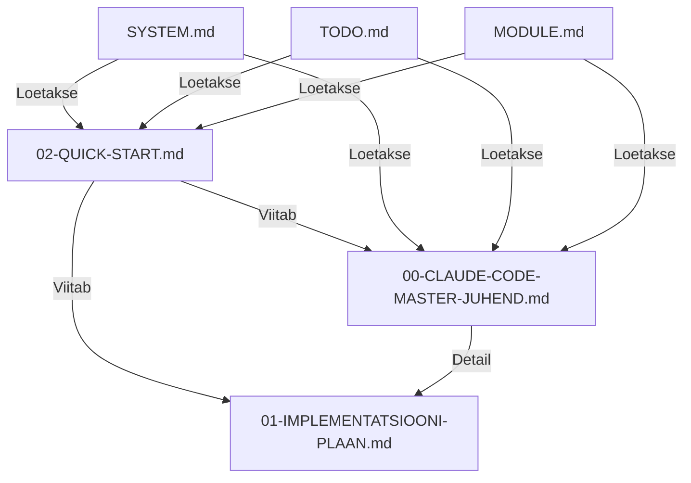

# 📚 EOS2 DOKUMENTATSIOONI INDEX

**Kuupäev:** 04.12.2025  
**Versioon:** 1.0  
**Projekt:** EOS2 - Enterprise Operating System 2

---

## 🎯 KIIRE NAVIGATSIOON

| Dokument | Eesmärk | Aeg | Prioriteet |
|----------|---------|-----|------------|
| [02-QUICK-START.md](#quick-start) | Alusta kiiresti! | 5 min | ⭐⭐⭐⭐⭐ |
| [00-CLAUDE-CODE-MASTER-JUHEND.md](#master-juhend) | Põhjalik ülevaade | 30 min | ⭐⭐⭐⭐ |
| [01-IMPLEMENTATSIOONI-PLAAN.md](#implementatsioon) | Samm-sammult plaan | 1 tund | ⭐⭐⭐⭐ |

---

## 📄 DOKUMENTIDE KIRJELDUSED

### QUICK START

**Fail:** `02-QUICK-START.md`  
**Eesmärk:** Alusta kohe tööga - kõige olulisem info kokkuvõttes  
**Lugemisaeg:** 5 minutit  
**Kasuta kui:**
- Alustad esimest korda
- Vajad kiiret meeldetuletust
- Tahad ülevaadet struktuurist

**Sisaldab:**
- 3 peamist printsiipi
- Struktuur ülevaade
- Käskude loetelu
- Workflow
- 5-sammuline uue mooduli loomine
- Kriitilised reeglid
- Troubleshooting

---

### MASTER JUHEND

**Fail:** `00-CLAUDE-CODE-MASTER-JUHEND.md`  
**Eesmärk:** Põhjalik ülevaade kogu süsteemist  
**Lugemisaeg:** 30 minutit  
**Kasuta kui:**
- Tahad sügavat mõistmist
- Arendad midagi keerulist
- Vajad referents-dokumenti

**Sisaldab:**
1. Visioon ja eesmärgid
2. Arhitektuuri põhimõtted
3. Failide struktuur
4. Automaatne registreerimine
5. Õiguste süsteem
6. Admin kontrollsüsteem
7. Design System
8. Arendusprotsess
9. Migratsioonid ja andmebaas
10. Testimine ja kvaliteet
11. Deployment ja CI/CD
12. Troubleshooting

**Erinevus QUICK START'ist:**
- Rohkem detaile
- Täielikud koodinäited
- Põhjalikud selgitused
- Visuaalid ja diagrammid

---

### IMPLEMENTATSIOONI PLAAN

**Fail:** `01-IMPLEMENTATSIOONI-PLAAN.md`  
**Eesmärk:** Samm-sammult plaan süsteemi ehitamiseks  
**Lugemisaeg:** 1 tund  
**Kasuta kui:**
- Alustad süsteemi ehitamist nullist
- Vajad selget tegevuskava
- Tahad teada, mis järjekorras teha

**Sisaldab:**
- **PHASE 1:** Baassüsteem (2-3h)
  - Andmebaasi migratsioonid
  - Tabelid: modules, components, actions, user_access
  
- **PHASE 2:** Õiguste süsteem (3-4h)
  - Rollid ja hierarhia
  - Toimingute definitsioon
  - Õiguste maatriks
  - Kaitse komponendid
  
- **PHASE 3:** Admin paneel (4-5h)
  - Admin layout
  - Dashboard
  - Moodulite haldus
  - Kasutajate õiguste maatriks
  
- **PHASE 4:** Registry süsteem (3-4h)
  - defineModule helper
  - registerModule function
  - App startup registreerimine
  
- **PHASE 5:** Design System (2-3h)
  - Design tokens
  - Ant Design theme
  - Core komponendid
  
- **PHASE 6:** Esimene moodul (1-2h)
  - Mooduli definitsioon
  - Dokumentatsioon
  - Lehed
  
- **PHASE 7:** Testimine (2-3h)
  - Unit testid
  - Integration testid
  - E2E testid
  
- **PHASE 8:** Dokumentatsioon (1-2h)
  - SYSTEM.md
  - TODO.md
  - CHANGELOG.md

**Kokku aega:** ~20-30 tundi

---

## 🔄 KUIDAS KASUTADA

### Esimene kord

```
1. LOE: 02-QUICK-START.md (5 min)
   ↓
2. TUTVU: 00-CLAUDE-CODE-MASTER-JUHEND.md (30 min)
   ↓
3. PLANEERI: 01-IMPLEMENTATSIOONI-PLAAN.md (1h)
   ↓
4. ALUSTA ARENDUST!
```

### Iga päev

```
1. LOE: SYSTEM.md (2 min)
   ↓
2. LOE: TODO.md (1 min)
   ↓
3. LOE: modules/[X]/MODULE.md (2 min)
   ↓
4. MEELDETULETUS: 02-QUICK-START.md (2 min)
   ↓
5. ARENDA!
```

### Probleemide korral

```
1. KONTROLLI: 02-QUICK-START.md → Troubleshooting
   ↓
2. KONTROLLI: 00-CLAUDE-CODE-MASTER-JUHEND.md → Troubleshooting
   ↓
3. KONTROLLI: SYSTEM.md → Teadaolevad probleemid
   ↓
4. KONTROLLI: TODO.md
```

---

## 📊 DOKUMENTIDE SEOS



---

## ✅ LUGEMISE KONTROLL-LIST

### Esimest korda arendades

- [ ] Loesin 02-QUICK-START.md täielikult
- [ ] Loesin 00-CLAUDE-CODE-MASTER-JUHEND.md täielikult
- [ ] Tutuvusin 01-IMPLEMENTATSIOONI-PLAAN.md'ga
- [ ] Loesin SYSTEM.md
- [ ] Loesin TODO.md
- [ ] Mõistan 3 peamist printsiipi:
  - [ ] Single Source of Truth
  - [ ] DRY (Don't Repeat Yourself)
  - [ ] Automaatne registreerimine
- [ ] Tean kus on core komponendid
- [ ] Tean kuidas õigusi kontrollida
- [ ] Tean kuidas uut moodulit luua

### Iga päev enne arendust

- [ ] Loesin SYSTEM.md (mis on uut?)
- [ ] Loesin TODO.md (mis on pooleli?)
- [ ] Loesin konkreetse mooduli MODULE.md
- [ ] Meenutasin 02-QUICK-START.md põhipunkte

---

## 🎯 EESMÄRGID DOKUMENDI KOHTA

### 02-QUICK-START.md
✅ Saad kohe alustada  
✅ Tead kõige olulisemat  
✅ Ei pea lugema tunde

### 00-CLAUDE-CODE-MASTER-JUHEND.md
✅ Mõistad süsteemi sügavuti  
✅ Tead kõiki detaile  
✅ Saad referents-dokumendiks

### 01-IMPLEMENTATSIOONI-PLAAN.md
✅ Tead täpset järjekorda  
✅ Tead ajakulgu  
✅ Näed selget teed

---

## 📖 TÄIENDAVAD RESSURSID

### Projektisisesed dokumendid

- `SYSTEM.md` - Süsteemi ülevaade (ALATI ESIMESENA!)
- `TODO.md` - Pooleli asjad ja planeeritud
- `CHANGELOG.md` - Muudatuste ajalugu
- `modules/*/MODULE.md` - Mooduli spetsiifilised dokumendid

### Välised ressursid

- [Next.js Docs](https://nextjs.org/docs)
- [Ant Design Docs](https://ant.design/docs/react/introduce)
- [Supabase Docs](https://supabase.com/docs)
- [TypeScript Docs](https://www.typescriptlang.org/docs)

---

## 🆘 ABI

### Kui midagi ei tööta

1. **Kontrolli troubleshooting sektsiooni:**
   - 02-QUICK-START.md → Troubleshooting
   - 00-CLAUDE-CODE-MASTER-JUHEND.md → § 12. Troubleshooting

2. **Kontrolli SYSTEM.md:**
   - Teadaolevad probleemid
   - Viimased muudatused

3. **Kontrolli TODO.md:**
   - Kas see on teadaolev probleem?

### Kui dokumentatsioon on aegunud

1. **Uuenda SYSTEM.md:**
   - Lisa viimased muudatused
   - Uuenda moodulite nimekirja

2. **Uuenda TODO.md:**
   - Lisa uued probleemid
   - Märgi tehtud asjad

3. **Uuenda MODULE.md:**
   - Kui muutsid moodulit

---

## 🎉 VALMIS!

Nüüd tead täpselt:
- ✅ Millised dokumendid on olemas
- ✅ Mida iga dokument sisaldab
- ✅ Millal millist dokumenti kasutada
- ✅ Kuidas alustada

**Esimene samm:** Loe `02-QUICK-START.md` ⭐

**Teine samm:** Loe `SYSTEM.md` ⭐⭐

**Kolmas samm:** ALUSTA ARENDUST! 🚀

---

**Viimati uuendatud:** 04.12.2025  
**Autor:** Silver @ Rivest OÜ  
**Versioon:** 1.0
