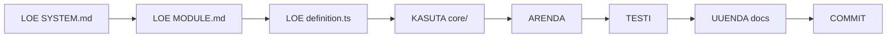

# ⚡ EOS2 QUICK START - CLAUDE CODE

**Kuupäev:** 04.12.2025  
**Eesmärk:** Alusta kohe tööga!

---

## 🎯 MISSIOON

Luua modulaarne ERP süsteem, kus:
- Uus moodul 30 minutiga
- Kõik on ühes kohas
- Admin näeb kõike
- Õigused automaatselt hallatavad

---

## 📖 ALUSTA LUGEDES

### 1. SYSTEM.md (ALATI ESIMESENA!)

```bash
cat SYSTEM.md
```

See fail sisaldab:
- Kõik aktiivsed moodulid
- Core komponendid
- Viimased muudatused
- Teadaolevad bugid
- TODO nimekiri

### 2. TODO.md

```bash
cat TODO.md
```

Kõik pooleli asjad ja planeeritud täiendused.

### 3. Mooduli MODULE.md

```bash
cat modules/[module]/MODULE.md
```

Konkreetse mooduli dokumentatsioon.

---

## 🏗️ STRUKTUUR

```
eos2/
├── SYSTEM.md              ⭐ LOE ALATI ESIMESENA
├── TODO.md                ⭐ Pooleli asjad
│
├── database/              ⭐ KOGU DB
│   └── migrations/
│
├── design/                ⭐ KOGU DISAIN
│   ├── tokens.ts
│   └── theme.ts
│
├── core/                  ⭐ JAGATUD SÜSTEEM
│   ├── permissions/       # Õigused
│   ├── ui/                # Komponendid
│   ├── data/              # Data layer
│   └── registry/          # Moodulite register
│
├── modules/               ⭐ KÕIK MOODULID
│   ├── _template/         # Kopeeri siit!
│   ├── projects/
│   ├── vehicles/
│   └── ...
│
└── admin/                 ⭐ ADMIN PANEEL
    └── pages/
```

---

## ⚡ 3 PEAMIST PRINTSIIPI

### 1. Single Source of Truth

**ÜKSAINUS FAIL** defineerib mooduli:

```typescript
// modules/vehicles/definition.ts
export default defineModule({
  name: 'vehicles',
  label: 'Sõidukid',
  database: { ... },      // → Loodoodomebase tabel
  permissions: { ... },   // → Admin maatriksisse
  components: [ ... ],    // → Admin registrisse
})
```

### 2. DRY - Don't Repeat Yourself

**ÄRA KUNAGI KOPEERI KOODI!**

✅ **ÕIGE:**
```typescript
import { DataTable } from '@/core/ui/DataTable'
import { useResource } from '@/core/data/useResource'
```

❌ **VALE:**
```typescript
// Copy-paste sama koodi
```

### 3. Automaatne registreerimine

```
definition.ts → App käivitub → KOHE nähtav kõikjal!
```

---

## 🚀 KÄSUD

```bash
# Arendus
pnpm dev

# Uus moodul
pnpm new-module

# Migratsioonid
pnpm db:migrate

# Kontrolli süsteemi
pnpm check

# Testid
pnpm test

# Build
pnpm build
```

---

## 📝 WORKFLOW



---

## 🎨 DESIGN SYSTEM

### Kasuta alati tokens

```typescript
import { tokens } from '@/design/tokens'

// Värvid
tokens.colors.primary
tokens.colors.success

// Spacing
tokens.spacing.md

// Status
tokens.status.active.bg
```

### Core komponendid

```typescript
// Tabel
<DataTable
  data={data}
  columns={columns}
  onEdit={handleEdit}
  onDelete={handleDelete}
/>

// Vorm
<FormBuilder
  definition={moduleDefinition}
  onSubmit={handleSubmit}
/>

// Staatuse badge
<StatusBadge 
  status="active"
  config={definition.statuses}
/>
```

---

## 🔐 ÕIGUSED

### Kontrolli õigust

```typescript
// Hookiga
const canCreate = usePermission('project:create')

// Komponendis
<ProtectedComponent permission="project:delete">
  <Button danger>Kustuta</Button>
</ProtectedComponent>

// Marsruut
<ProtectedRoute permission="admin:access">
  <AdminPanel />
</ProtectedRoute>
```

---

## 📊 ANDMEBAAS

### Migratsioon

```sql
-- database/migrations/XXX_my_module.sql

CREATE TABLE IF NOT EXISTS my_table (
  id UUID PRIMARY KEY DEFAULT uuid_generate_v4(),
  tenant_id UUID NOT NULL REFERENCES tenants(id),
  -- ...
);

-- RLS
ALTER TABLE my_table ENABLE ROW LEVEL SECURITY;

CREATE POLICY "Users can view own tenant"
  ON my_table FOR SELECT
  USING (tenant_id = auth.jwt() ->> 'tenant_id');
```

### Käivita

```bash
pnpm db:migrate
```

---

## 🆕 UUS MOODUL - 5 SAMMU

### 1. Kopeeri template

```bash
cp -r modules/_template modules/vehicles
```

### 2. Muuda definition.ts

```typescript
export default defineModule({
  name: 'vehicles',
  label: 'Sõidukid',
  // ... ~30 rida
})
```

### 3. Lisa migratsioon

```sql
-- database/migrations/XXX_vehicles.sql
CREATE TABLE vehicles ( ... );
```

### 4. Käivita

```bash
pnpm db:migrate
pnpm dev
```

### 5. VALMIS! 🎉

Moodul on:
- ✅ Registreeritud
- ✅ Menüüs nähtav
- ✅ Adminisse ilmunud
- ✅ Õigused hallatavad

---

## ⚠️ KRIITILISED REEGLID

### 1. LOE ALATI ESIMESENA

```bash
cat SYSTEM.md
cat TODO.md
cat modules/[module]/MODULE.md
```

### 2. KASUTA CORE KOMPONENTE

```typescript
// ✅ ÕIGE
import { DataTable } from '@/core/ui/DataTable'

// ❌ VALE
// Copy-paste kood
```

### 3. JÄRGI DESIGN SYSTEM'I

```typescript
// ✅ ÕIGE
import { tokens } from '@/design/tokens'
color: tokens.colors.primary

// ❌ VALE
color: '#279989'  // Hard-coded
```

### 4. UUENDA DOKUMENTATSIOONI

Pärast muudatusi ALATI uuenda:
- SYSTEM.md
- TODO.md
- MODULE.md (kui mooduli sees)

---

## 🐛 TROUBLESHOOTING

### Moodul ei ilmu menüüsse

```bash
# 1. Restart
pnpm dev

# 2. Kontrolli console
# Peaks olema: "✅ Module vehicles registered"

# 3. Kontrolli definition.ts
cat modules/vehicles/definition.ts | grep "menu:"
```

### Õigused ei tööta

```bash
# 1. Kontrolli matrix
cat core/permissions/matrix.ts

# 2. Kontrolli RLS
psql -c "SELECT * FROM pg_policies WHERE tablename = 'vehicles';"
```

### Migratsioon ebaõnnestus

```bash
# 1. Vaata vigu
pnpm db:migrate --verbose

# 2. Rollback
pnpm db:migrate:rollback

# 3. Paranda ja proovi uuesti
```

---

## ✅ KONTROLL-LIST

Enne iga tööd:

- [ ] Loesin SYSTEM.md
- [ ] Loesin TODO.md
- [ ] Loesin MODULE.md
- [ ] Kontrollisin core komponente
- [ ] Kasutan core komponente
- [ ] Järgin design system'i
- [ ] Lisan õiguste kontrolli
- [ ] Testan lokaalselt
- [ ] Uuendan dokumentatsiooni
- [ ] Commit + Push

---

## 📚 LISA DOKUMENDID

Täpsemad juhised:

1. **00-CLAUDE-CODE-MASTER-JUHEND.md** - Põhjalik ülevaade
2. **01-IMPLEMENTATSIOONI-PLAAN.md** - Samm-sammult plaan
3. **SYSTEM.md** - Süsteemi ülevaade
4. **TODO.md** - Poolikud asjad

---

## 🎉 VALMIS!

Nüüd oled valmis arendama!

**Esimene samm:** LOE `SYSTEM.md` ⭐

**Viimati uuendatud:** 04.12.2025
