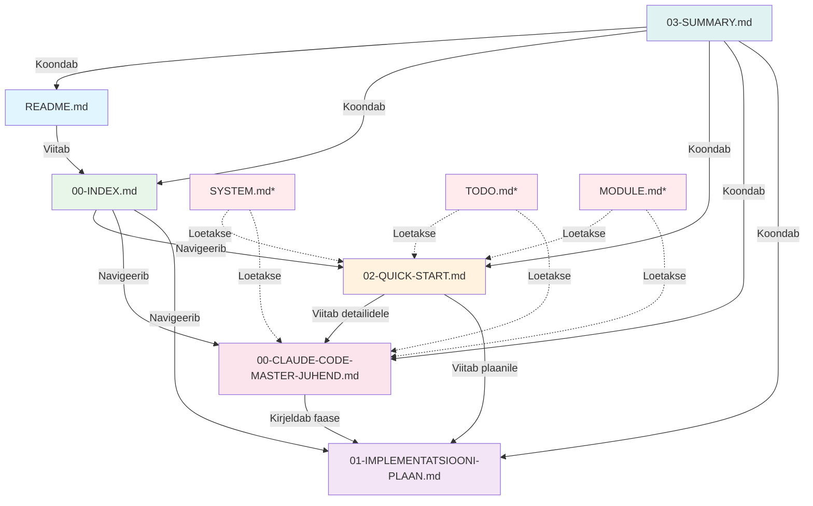

# 🌳 EOS2 DOKUMENTATSIOONIPUU

**Kuupäev:** 04.12.2025  
**Projekt:** EOS2 - Enterprise Operating System 2

---

## 📊 FAILIDE ÜLEVAADE

```
manual/04.12.25/
│
├── 📘 README.md (4.5 KB)
│   └─► Kausta ülevaade
│       ├─ Mis on loodud?
│       ├─ Kuidas alustada?
│       └─ Kontroll-list
│
├── 📗 00-INDEX.md (6.4 KB)
│   └─► Navigatsioon ja seoste kirjeldus
│       ├─ Kõigi failide kirjeldused
│       ├─ Millal millist faili kasutada
│       ├─ Lugemise kontroll-list
│       └─ Abi ja troubleshooting
│
├── 📕 02-QUICK-START.md (6.3 KB)
│   └─► Kiire alustamise juhend
│       ├─ 3 peamist printsiipi
│       ├─ Struktuur ja käsud
│       ├─ 5-sammuline uue mooduli loomine
│       ├─ Workflow
│       ├─ Kriitilised reeglid
│       └─ Troubleshooting
│
├── 📙 00-CLAUDE-CODE-MASTER-JUHEND.md (45 KB)
│   └─► Põhjalik ülevaade (12 peatükki)
│       ├─ § 1. Visioon ja eesmärgid
│       ├─ § 2. Arhitektuuri põhimõtted
│       ├─ § 3. Failide struktuur
│       ├─ § 4. Automaatne registreerimine
│       ├─ § 5. Õiguste süsteem
│       ├─ § 6. Admin kontrollsüsteem
│       ├─ § 7. Design System
│       ├─ § 8. Arendusprotsess
│       ├─ § 9. Migratsioonid ja andmebaas
│       ├─ § 10. Testimine ja kvaliteet
│       ├─ § 11. Deployment ja CI/CD
│       └─ § 12. Troubleshooting
│
├── 📔 01-IMPLEMENTATSIOONI-PLAAN.md (33 KB)
│   └─► Samm-sammult plaan (8 faasi)
│       ├─ PHASE 1: Baassüsteem (2-3h)
│       ├─ PHASE 2: Õiguste süsteem (3-4h)
│       ├─ PHASE 3: Admin paneel (4-5h)
│       ├─ PHASE 4: Registry süsteem (3-4h)
│       ├─ PHASE 5: Design System (2-3h)
│       ├─ PHASE 6: Esimene moodul (1-2h)
│       ├─ PHASE 7: Testimine (2-3h)
│       └─ PHASE 8: Dokumentatsioon (1-2h)
│
└── 📓 03-SUMMARY.md (9.9 KB)
    └─► Kokkuvõte kõigest
        ├─ Mis on loodud?
        ├─ Visioon
        ├─ Arhitektuur
        ├─ Implementatsiooni plaan
        ├─ Oodatud tulemus
        └─ Järgmine samm

KOKKU: 105 KB dokumentatsiooni
```

---

## 🔗 DOKUMENTIDE SEOSTE DIAGRAMM



*SYSTEM.md, TODO.md, MODULE.md asuvad peamises projektikaustas

---

## 📖 LUGEMISE VOOG

### Esimene kord (kokku ~1h 45min)

```
START
  ↓
README.md (2 min)
  ├─ Kiire ülevaade
  └─ Mis on loodud?
  ↓
00-INDEX.md (5 min)
  ├─ Kõigi failide kirjeldused
  ├─ Millal millist kasutada
  └─ Navigatsioon
  ↓
02-QUICK-START.md (5 min)
  ├─ 3 peamist printsiipi
  ├─ Kiire ülevaade
  └─ Workflow
  ↓
00-CLAUDE-CODE-MASTER-JUHEND.md (30 min)
  ├─ § 1-4: Arhitektuur
  ├─ § 5-7: Õigused, Admin, Design
  └─ § 8-12: Arendus, Testing, Deploy
  ↓
01-IMPLEMENTATSIOONI-PLAAN.md (60 min)
  ├─ PHASE 1-8
  ├─ Samm-sammult juhised
  └─ Kontroll-listid
  ↓
VALMIS ARENDAMA! 🚀
```

### Iga päev (kokku ~7 min)

```
START
  ↓
SYSTEM.md (2 min)
  └─ Mis on uut? Mis on valmis?
  ↓
TODO.md (1 min)
  └─ Mis on pooleli? Mis bugid?
  ↓
MODULE.md (2 min)
  └─ Kui muudan konkreetset moodulit
  ↓
02-QUICK-START.md (2 min)
  ├─ Workflow meeldetuletus
  ├─ Kriitilised reeglid
  └─ Troubleshooting
  ↓
ARENDA! 💻
```

---

## 🎯 PRIORITEEDID

### ⭐⭐⭐⭐⭐ KRIITILINE (loe ALATI)

1. **README.md** - Kausta ülevaade
2. **00-INDEX.md** - Navigatsioon
3. **02-QUICK-START.md** - Igapäevane juhend
4. **SYSTEM.md*** - Projekti ülevaade

### ⭐⭐⭐⭐ OLULINE (tutvu põhjalikult)

5. **00-CLAUDE-CODE-MASTER-JUHEND.md** - Põhjalik referents
6. **01-IMPLEMENTATSIOONI-PLAAN.md** - Ehitamise plaan

### ⭐⭐⭐ ABISTAV (kasuta vajaduse korral)

7. **03-SUMMARY.md** - Kokkuvõte
8. **TODO.md*** - Pooleli asjad
9. **MODULE.md*** - Moodulite detailid

*Asuvad projekti peamises kaustas

---

## 📊 SISU KAART

### README.md (Sissejuhatus)
```
📘 README.md
├── 🎯 Mis on loodud?
├── 📚 Failid
├── 🎯 Silver'i visioon
├── 🚀 Kuidas alustada?
├── ⚠️ Kriitilised reeglid
└── ✅ Kontroll-list
```

### 00-INDEX.md (Navigatsioon)
```
📗 00-INDEX.md
├── 🎯 Kiire navigatsioon
├── 📄 Dokumentide kirjeldused
│   ├── QUICK START
│   ├── MASTER JUHEND
│   └── IMPLEMENTATSIOON
├── 🔄 Kuidas kasutada
├── 📊 Dokumentide seos
├── ✅ Lugemise kontroll-list
└── 🆘 Abi
```

### 02-QUICK-START.md (Kiire algus)
```
📕 02-QUICK-START.md
├── 🎯 Missioon
├── 📖 Alusta lugedes
├── 🏗️ Struktuur
├── ⚡ 3 peamist printsiipi
├── 🚀 Käsud
├── 📝 Workflow
├── 🎨 Design System
├── 🔐 Õigused
├── 📊 Andmebaas
├── 🆕 Uus moodul (5 sammu)
├── ⚠️ Kriitilised reeglid
├── 🐛 Troubleshooting
└── ✅ Kontroll-list
```

### 00-CLAUDE-CODE-MASTER-JUHEND.md (Põhjalik)
```
📙 00-CLAUDE-CODE-MASTER-JUHEND.md
├── § 1. VISIOON JA EESMÄRGID
│   ├── Põhivisioon
│   ├── Disaini põhimõte
│   └── Võtmeomadused
│
├── § 2. ARHITEKTUURI PÕHIMÕTTED
│   ├── Single Source of Truth
│   ├── Kihiline arhitektuur
│   ├── DRY põhimõte
│   └── Mooduli anatoomia
│
├── § 3. FAILIDE STRUKTUUR
│   └── Täielik struktuur (500+ rida)
│
├── § 4. AUTOMAATNE REGISTREERIMINE
│   ├── Kuidas töötab
│   ├── definition.ts
│   ├── Registreerimise protsess
│   └── Uue mooduli loomine
│
├── § 5. ÕIGUSTE SÜSTEEM
│   ├── Rollid ja hierarhia
│   ├── Toimingud
│   ├── Õiguste maatriks
│   ├── Õiguste kontrollimine
│   └── Kaitse komponendid
│
├── § 6. ADMIN KONTROLLSÜSTEEM
│   ├── Admin Dashboard
│   ├── Moodulite haldus
│   ├── Kasutaja ligipääsud
│   └── Visuaalne õiguste maatriks
│
├── § 7. DESIGN SYSTEM
│   ├── Design Tokens
│   └── Ant Design Theme
│
├── § 8. ARENDUSPROTSESS
│   ├── Workflow
│   ├── Käsud
│   ├── SYSTEM.md struktuur
│   └── MODULE.md struktuur
│
├── § 9. MIGRATSIOONID JA ANDMEBAAS
│   ├── Migratsioonide struktuur
│   ├── Migratsiooni mall
│   └── Käivitamine
│
├── § 10. TESTIMINE JA KVALITEET
│   ├── Testide struktuur
│   └── Testi näide
│
├── § 11. DEPLOYMENT JA CI/CD
│   ├── Deployment
│   └── CI/CD Pipeline
│
└── § 12. TROUBLESHOOTING
    ├── Moodul ei ilmu
    ├── Õigused ei tööta
    └── Migratsioon ebaõnnestus
```

### 01-IMPLEMENTATSIOONI-PLAAN.md (Ehitamine)
```
📔 01-IMPLEMENTATSIOONI-PLAAN.md
├── PHASE 1: Baassüsteem (2-3h)
│   ├── Andmebaasi migratsioonid
│   ├── Käivita migratsioon
│   └── Kontrolli
│
├── PHASE 2: Õiguste süsteem (3-4h)
│   ├── Rollide definitsioon
│   ├── Toimingute definitsioon
│   ├── Õiguste maatriks
│   ├── Õiguste kontroll
│   └── Kaitse komponendid
│
├── PHASE 3: Admin paneel (4-5h)
│   ├── Admin layout
│   ├── Dashboard
│   ├── Moodulite haldus
│   └── Kasutajate õigused
│
├── PHASE 4: Registry süsteem (3-4h)
│   ├── defineModule helper
│   ├── registerModule function
│   └── App startup
│
├── PHASE 5: Design System (2-3h)
│   ├── Design tokens
│   ├── Ant Design theme
│   └── Core komponendid
│
├── PHASE 6: Esimene moodul (1-2h)
│   ├── Mooduli definitsioon
│   ├── Dokumentatsioon
│   └── Lehed
│
├── PHASE 7: Testimine (2-3h)
│   ├── Unit testid
│   ├── Integration testid
│   └── E2E testid
│
└── PHASE 8: Dokumentatsioon (1-2h)
    ├── SYSTEM.md
    ├── TODO.md
    └── CHANGELOG.md
```

### 03-SUMMARY.md (Kokkuvõte)
```
📓 03-SUMMARY.md
├── 🎯 Mis on loodud?
├── 📚 Loodud dokumendid
├── 🎨 Silver'i visioon
├── 🏗️ Arhitektuur
├── 📁 Failide struktuur
├── 🔐 Õiguste süsteem
├── 👑 Admin paneel
├── 🆕 Uus moodul
├── 📊 Implementatsiooni plaan
├── ⚡ Kiire start guide
├── ⚠️ Kriitilised reeglid
├── 🎯 Võtme-käsud
├── 📈 Oodatud tulemus
├── ✅ Lõplik kontroll-list
├── 🎉 Tulemus
└── 🚀 Järgmine samm
```

---

## 📈 STATISTIKA

### Failid

| Mõõdik | Väärtus |
|--------|---------|
| Faile kokku | 6 |
| Kokku KB | 105 KB |
| Kokku read | ~3500 |
| Koodinäiteid | 50+ |
| Diagramme | 5+ |
| Peatükke | 40+ |

### Sisu

| Kategooria | Näited |
|------------|--------|
| Arhitektuur | 12 peatükki |
| Implementatsioon | 8 faasi |
| Koodinäiteid | TypeScript, SQL, Bash |
| Diagramme | Mermaid, ASCII |
| Kontroll-liste | 5+ |
| Troubleshooting | 10+ juhtumit |

### Ajakulu

| Tegevus | Aeg |
|---------|-----|
| Lugemisaeg (esimene kord) | ~1h 45min |
| Igapäevane lugemine | ~7 min |
| Implementatsioon | 20-30h |
| Uue mooduli loomine | 30 min |

---

## ✅ KVALITEEDI KONTROLL

### Dokumentatsioon

- [x] Selge struktuur
- [x] Loogiline järjestus
- [x] Koodinäited
- [x] Diagrammid
- [x] Kontroll-listid
- [x] Troubleshooting
- [x] Näited ja mallid
- [x] Viited ja seosed

### Sisu

- [x] Visioon ja eesmärgid
- [x] Arhitektuuri põhimõtted
- [x] Failide struktuur
- [x] Automaatne registreerimine
- [x] Õiguste süsteem
- [x] Admin paneel
- [x] Design System
- [x] Arendusprotsess
- [x] Migratsioonid
- [x] Testimine
- [x] Deployment
- [x] Troubleshooting

### Kasutatavus

- [x] Kiire alustamine
- [x] Selged juhised
- [x] Samm-sammult plaan
- [x] Igapäevane tugi
- [x] Probleemide lahendamine

---

## 🎉 KOKKUVÕTE

**Sul on nüüd:**

✅ **6 dokumenti** (105 KB)  
✅ **~3500 rida** kvaliteetset dokumentatsiooni  
✅ **50+ koodinäited** TypeScript, SQL, Bash  
✅ **5+ diagrammi** ja visualiseeringut  
✅ **40+ peatükki** põhjalikku infot  
✅ **8 faasi** implementatsiooni plaani  
✅ **10+ troubleshooting** juhtumit  
✅ **5+ kontroll-listi** kvaliteedi tagamiseks  

**Claude Code saab nüüd:**

✅ Iseseisvalt arendada EOS2 süsteemi  
✅ Järgida arhitektuuri põhimõtteid  
✅ Luua uusi mooduleid 30 minutiga  
✅ Hoida koodi kvaliteetset ja DRY  
✅ Dokumenteerida kõiki muudatusi  
✅ Testida ja deployda professionaalselt  

---

**🚀 VALMIS KASUTAMISEKS!** 🚀

**Viimati uuendatud:** 04.12.2025  
**Staatus:** ✅ COMPLETE

---

## 📞 VIITED

**Dokumentide asukoht:**
```
/mnt/user-data/outputs/manual/04.12.25/
```

**Projekti asukoht:**
```
/path/to/eos2/
```

**Alusta:**
```bash
cd manual/04.12.25
cat README.md
```

---

🎓 **HEAD ÕPPIMIST JA ARENDAMIST!** 🎓
